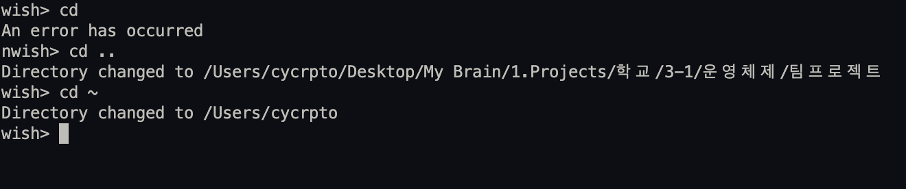
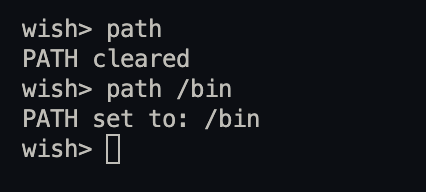
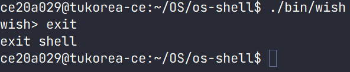
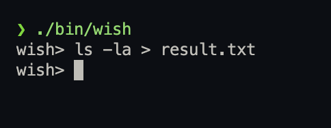
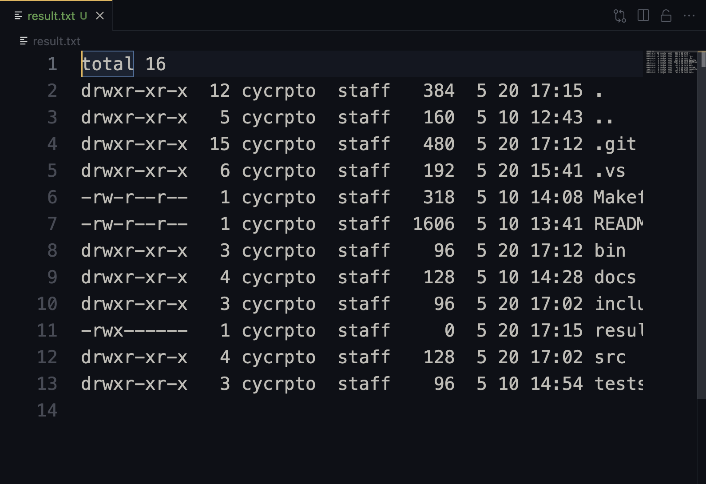

# Wish Shell 프로젝트 문서

## 파일 설명
### `wish.h`
`wish.h`는 프로젝트의 헤더 파일로, 다음과 같은 내용을 포함합니다:
- 함수 선언: `print_error`, `execute_command`등 프로젝트에서 사용되는 함수들의 선언을 포함합니다.

- 상수 정의: `MAX_INPUT_SIZE`, `PROMPT`, `ERROR_MESSAGE` 등 기본적인 상수를 정의합니다.

- `include guard`: 헤더 파일의 중복 포함을 방지하기 위해 `ifndef` 및 `define` 가드를 포함합니다.

이 헤더 파일을 통해 프로젝트의 함수 선언과 상수를 공유하고, 코드의 일관성을 유지할 수 있습니다.

### `wish.c`
프로젝트의 메인 소스 코드로 대화형 모드와 배치모드를 지원합니다.
- **쉘 루프**: 무한 루프를 통해 프롬프트를 출력하고, 사용자 입력을 기다립니다.
- **명령어 파싱**: `strtok` 등을 사용하여 사용자 입력을 파싱하고, 명령어와 인자를 추출합니다.
- **프로세스 생성 및 실행**: `fork`와 `execvp`를 사용하여 프로세스를 생성하고 명령어를 실행합니다.
- **에러 처리**: 프로세스 생성 실패나 명령어 실행 실패 등의 경우, 표준 에러로 에러 메시지를 출력합니다.

`wish.c`는 `wish.h`를 포함하여 필요한 함수와 상수를 참조하며, 쉘의 기본 기능을 구현합니다.

## 확장 가능성
이 프로젝트는 모듈화된 구조를 통해 확장이 가능합니다. 다음은 향후 확장할 수 있는 기능의 예시입니다:
- **내장 명령어 추가**: `exit`, `cd` 외에 다른 내장 명령어(예: `path`)를 추가할 수 있습니다.
- **병렬 명령어 실행**: `&` 연산자를 사용하여 여러 명령어를 동시에 실행하는 기능을 추가할 수 있습니다.
- **출력 리디렉션**: `>` 문자를 사용하여 명령어의 출력을 파일로 리디렉션하는 기능을 구현할 수 있습니다.


## 사용 방법
프로젝트를 사용하려면 다음 단계를 따르세요:

1. **컴파일**: 프로젝트 디렉터리에서 `make` 명령을 사용하여 `wish.c`를 컴파일합니다.
2. **실행**: 컴파일 후 생성된 실행 파일을 실행하여 쉘을 시작합니다.
3. **클린**: `make clean`을 사용하여 컴파일 후 생성된 임시 파일을 제거합니다.

프로젝트를 성공적으로 컴파일하고 실행한 후에는, 프롬프트에서 원하는 명령어를 입력하고 결과를 확인할 수 있습니다.

## 실행
1. 아래와같이 쉘을 실행한다면 대화형모드로 실행합니다.
```bash
prompt > ./bin/wish
```

2. 아래와같이 쉘을 실행한다면 배치모드로 실행합니다.
```bash
prompt > ./bin/wish ./tests/batch_test.txt
```

## 명령어
### cd
> 현재 직업 디렉터리를 변경한다.


```c
void command_cd(char* directory) {
    if (chdir(directory) != 0) {
        print_error();
    }
}
```
- `chdir(directory)`로 현재 작업 디렉터리를 변경하고, 만약 실패했을시 오류 메시지를 출력하도록 설계하였다.

### path
> 명령어 검색 경로를 설정하거나 출력한다.



```c
void command_path(char** paths) {
    if (paths[0] == NULL) {
        setenv("PATH", "", 1);
        printf("PATH cleared\n");
    } else {
        char new_path[MAX_INPUT_SIZE] = "";
        for (int i = 0; paths[i] != NULL; i++) {
            if (i > 0) {
                strcat(new_path, ":");
            }
            strcat(new_path, paths[i]);
        }
        setenv("PATH", new_path, 1);
        printf("PATH set to: %s\n", new_path);
    }
}
```
- `setenv("PATH", "", 1)`: 인자가 없을 경우 PATH를 비운다.
- 경로 인자들을 연결하여 새로운 PATH로 설정한다.
- 설정된 PATH를 출력한다.

### exit
> 쉘을 종료한다.


```c
void command_exit() {
    printf("exit shell\n");
    exit(0);
}
```
- 쉘 종료 문구를 출력하고 쉘을 종료한다.

## 기능
### 리다이렉션 (>)
> 명령어의 출력을 지정한 파일로 리다이렉션 한다.





#### 구현 설명
- 리다이렉션은 명령어를 파싱할 때 `>` 문자를 확인하여 구현한다. 
- 아래 코드에서는 들어온 명령어를 token화 하는 과정에 리다이렉션인지 트리거하는 문자를 확인하는 과정을 추가했다.

```c
  while (token != NULL) {
        if (strcmp(token, ">") == 0) {
            token = strtok(NULL, " \t");
            if (token != NULL) {
                output_file = token;
            } else {
                print_error();
                return;
            }
            break;
        } else {
            args[argc++] = token;
        }
        token = strtok(NULL, " \t");
    }
```

## 참고 자료
- [Makefile 및 빌드 시스템](https://en.wikipedia.org/wiki/Make_(software))
- 
- 
